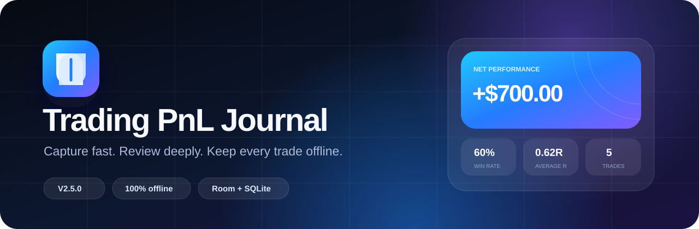
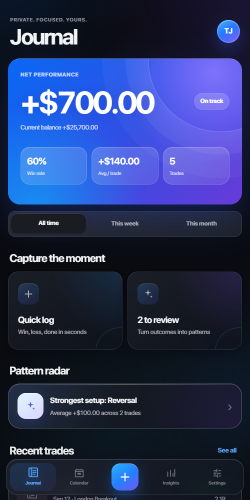
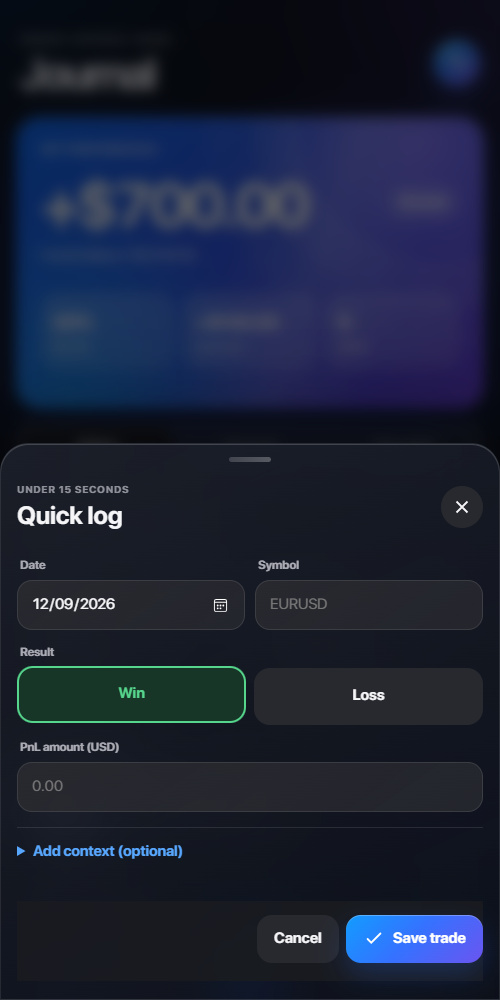
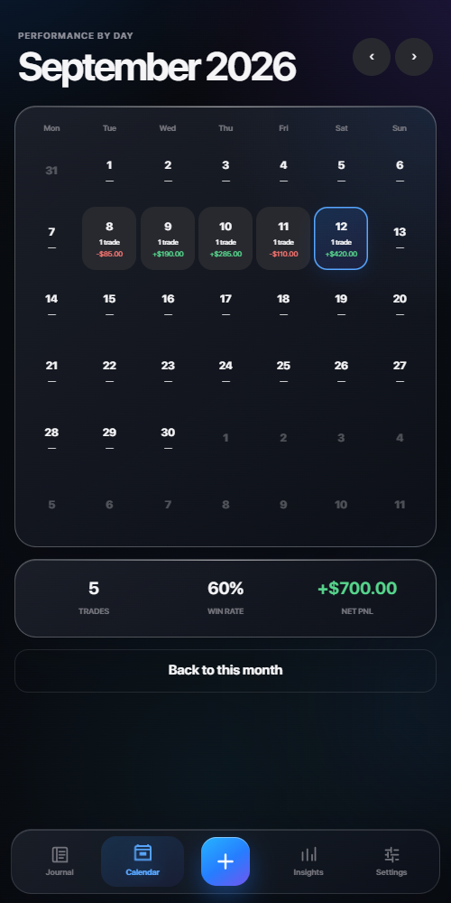
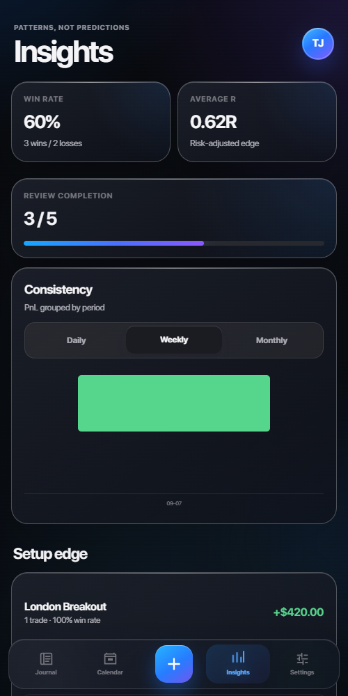
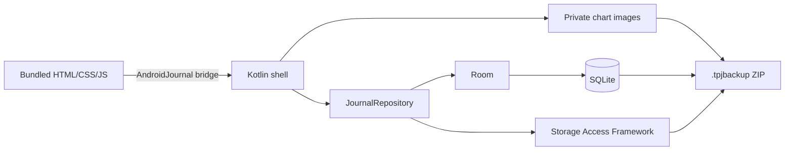

<p align="center">
  
</p>

<p align="center">
  <a href="https://github.com/rahmatmaul/trading-pnl-journal-android/actions/workflows/android.yml"></a>
  
  
  
  
</p>

<p align="center">
  Jurnal trading Android yang cepat, visual, dan benar-benar offline.<br>
  Tidak ada akun, server, iklan, tracker, atau database cloud.
</p>

<p align="center">
  <a href="https://github.com/rahmatmaul/trading-pnl-journal-android/raw/main/release/TradingPnLJournal-v2.5.0.apk"><strong>Download APK V2.5</strong></a>
  ·
  <a href="#cara-install"><strong>Cara install</strong></a>
  ·
  <a href="#build-dari-source"><strong>Build source</strong></a>
  ·
  <a href="CHANGELOG.md"><strong>Changelog</strong></a>
</p>

## Trading PnL Journal V2.5

V2.5 adalah rilis utama saat ini. Tampilan dibuat lebih matang dengan layered
gradients, glass surfaces, tipografi yang lebih rapi, app icon adaptive baru,
dan motion antarlayar yang ringan. Alur pencatatan tetap sengaja singkat:
catat hasil dalam beberapa detik, lalu lengkapi konteks hanya saat dibutuhkan.

<p align="center">
  
  
  
  
</p>

<p align="center"><sub>Screenshot aktual UI V2.5: Journal, Quick Log, Calendar, dan Insights.</sub></p>

### Yang baru di V2.5

- Visual baru dengan gradient biru-violet, depth yang terkontrol, glass card,
  dan hierarchy teks yang lebih jelas.
- Motion system baru: directional slide antarlayar, spring bottom sheet,
  feedback tombol, navigation bounce, serta toast yang lebih halus.
- Animasi kontinu yang berat dihilangkan agar WebView Android tetap mulus.
- Tipografi seluruh aplikasi diseragamkan dan dioptimalkan untuk layar ponsel.
- Adaptive app icon baru dengan simbol folded journal dan negative-space path.
- Dokumentasi screenshot aktual serta APK V2.5 siap unduh langsung dari repo.

## Fitur final

| Area | Kemampuan |
| --- | --- |
| Quick Log | Tanggal, simbol, Win/Loss, dan PnL untuk pencatatan cepat |
| Trade Story | Setup, session, emotion, planned/realized R, execution score, mistake tags, lesson, dan review status |
| Chart evidence | Hingga 6 screenshot per trade sebagai Before/thesis atau After/result |
| Journal | Net performance, current balance, win rate, average trade, recent trades, review queue, dan equity curve |
| Calendar | Ringkasan harian, jumlah trade, win rate, dan net PnL bulanan |
| Insights | Average R, consistency, review completion, setup edge, dan session edge |
| Trade management | Add, edit, delete, duplicate, detail, filter periode/result/symbol, dan sorting |
| Risk settings | Starting balance, profit target, max drawdown, dan daily loss warning |
| Personalization | Light, dark, atau mengikuti tema Android |
| Data portability | Full package, JSON, CSV, Merge import, Replace import, dan automatic recovery |
| Offline | Asset UI lokal, Room/SQLite, tanpa permission internet |

## Data yang tidak hilang saat aplikasi ditutup

Sumber kebenaran jurnal adalah **Room + SQLite**, bukan `localStorage`. Tombol
**Save trade** baru menampilkan sukses setelah transaksi database selesai.

Data internal bertahan saat berpindah halaman, aplikasi ditutup, dihapus dari
Recents, di-force-stop, perangkat reboot, dan APK dengan signature yang sama
dipasang sebagai update. Android tetap menghapus private app data saat uninstall,
jadi portable backup tetap penting.

## Arsitektur



WebView hanya memuat asset lokal dari `appassets.androidplatform.net`. Request
ke origin lain diblokir, DOM storage dimatikan, dan manifest tidak meminta
permission `INTERNET`. Gambar chart disimpan di private app storage; metadata dan
SHA-256 checksum disimpan di Room.

## Backup dan restore

### Full package — direkomendasikan

File `.tpjbackup` adalah ZIP tervalidasi yang membawa:

- `journal.json` berisi trade, settings, dan metadata attachment;
- chart JPEG, PNG, atau WebP;
- ukuran file serta SHA-256 checksum untuk mendeteksi kerusakan.

**Merge** menambahkan ID trade yang belum ada. **Replace** memvalidasi seluruh
paket sebelum mengganti jurnal dalam satu transaksi. Jalur ZIP diperiksa untuk
mencegah path traversal, ukuran file dibatasi, dan file sementara dibersihkan
jika import gagal.

JSON tetap tersedia untuk backup lama V1/V2 dan pertukaran tanpa gambar. CSV
ditujukan untuk spreadsheet dan memuat metadata review. Untuk automatic recovery,
buka **Settings → Automatic recovery → Choose backup folder** lalu pilih folder
melalui Android Storage Access Framework. Aplikasi menyimpan hingga lima snapshot.

## Cara install

1. Download [`TradingPnLJournal-v2.5.0.apk`](https://github.com/rahmatmaul/trading-pnl-journal-android/raw/main/release/TradingPnLJournal-v2.5.0.apk).
2. Buka file melalui File Manager di Android.
3. Jika diminta, aktifkan **Install unknown apps** hanya untuk File Manager yang
   digunakan.
4. Tekan **Install**, buka aplikasi, lalu pilih automatic recovery folder.

Untuk update dari versi lama, pasang APK baru langsung di atas aplikasi lama dan
**jangan uninstall versi lama terlebih dahulu**. Migrasi Room eksplisit
mempertahankan trade yang sudah tersimpan. Buat backup sebelum update sebagai
langkah berjaga-jaga.

## Build dari source

Prasyarat: JDK 17/21, Android SDK Platform 35, dan Build Tools 35+.

Windows:

```powershell
.\gradlew.bat testDebugUnitTest lintDebug assembleDebug --no-daemon
```

Linux/macOS:

```bash
./gradlew testDebugUnitTest lintDebug assembleDebug --no-daemon
```

APK debug tersedia di `app/build/outputs/apk/debug/app-debug.apk`. Asset font
mentah tidak disertakan dalam repository; source tetap dapat dibangun dan akan
menggunakan system sans-serif sebagai fallback bila asset lokal tidak tersedia.

## Riwayat versi

| Versi | Fokus update |
| --- | --- |
| **V2.5** | Visual polish, typography, adaptive icon, dan motion yang lebih mulus |
| **V2.0** | Quick Log, Trade Story, chart evidence, Insights, dan `.tpjbackup` |
| **V1.0** | Fondasi offline, Room/SQLite, CRUD, JSON/CSV, calendar, dan stats |

Rincian setiap rilis tersedia di [CHANGELOG.md](CHANGELOG.md).

## Pengujian

Suite JVM/Robolectric mencakup 14 test untuk CRUD, duplicate, reopen persistence,
settings, Win/Loss sign normalization, JSON legacy/V2, CSV escaping, malformed
backup, duplicate merge, atomic replace, attachment cascade, package checksum
round-trip, dan migrasi database V1→V2 tanpa kehilangan trade.

```powershell
.\gradlew.bat testDebugUnitTest --no-daemon
```

## Privasi dan keamanan

- Tidak ada analytics, telemetry, iklan, login, atau remote crash reporting.
- Tidak ada broad storage permission maupun permission internet.
- Data jurnal berada di perangkat dan folder backup yang pengguna pilih.
- Import selalu divalidasi sebelum data aktif diubah.

## Kontribusi

Bug report dan ide fitur dipersilakan. Baca [CONTRIBUTING.md](CONTRIBUTING.md)
sebelum membuka pull request. Untuk masalah keamanan, ikuti
[SECURITY.md](SECURITY.md) dan jangan pernah unggah backup jurnal asli.

## Lisensi

Belum ada lisensi penggunaan ulang yang diberikan. Source tersedia untuk
ditinjau, tetapi hak penggunaan, modifikasi, dan distribusi belum diberikan
sampai maintainer memilih lisensi proyek.
