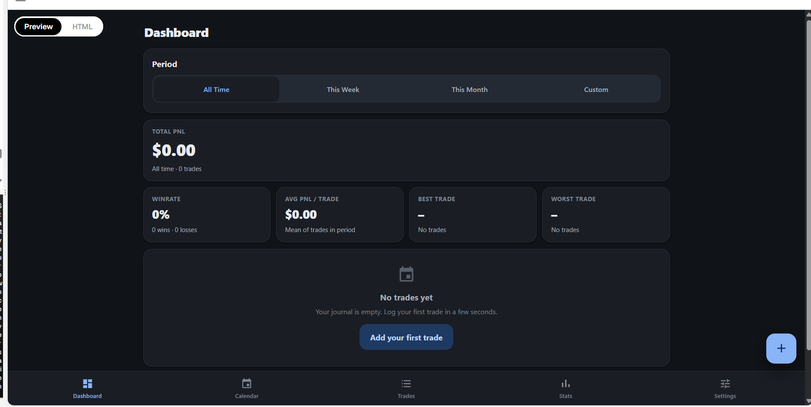
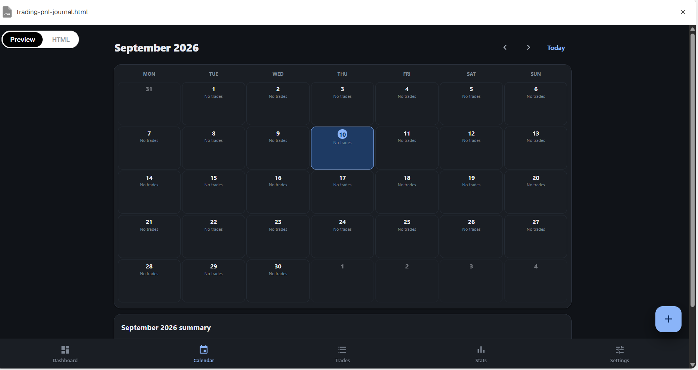
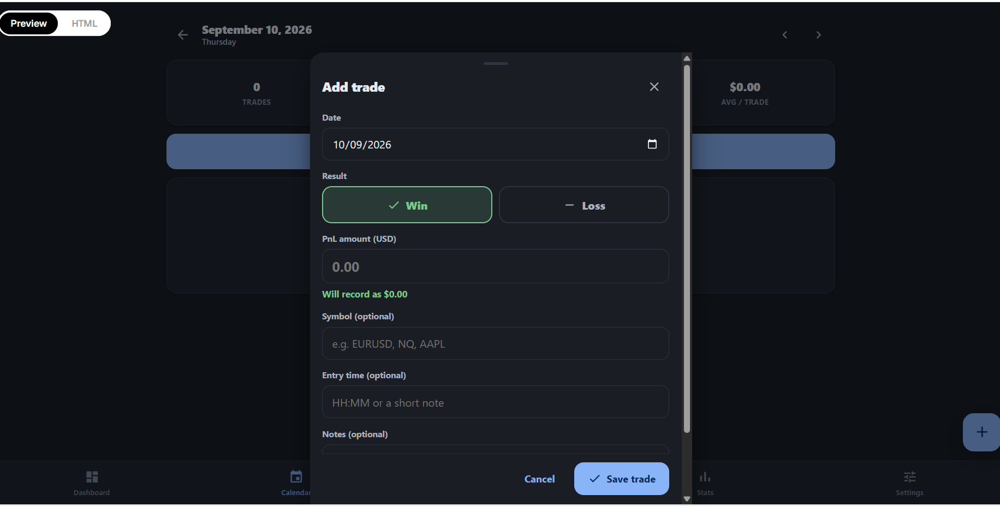
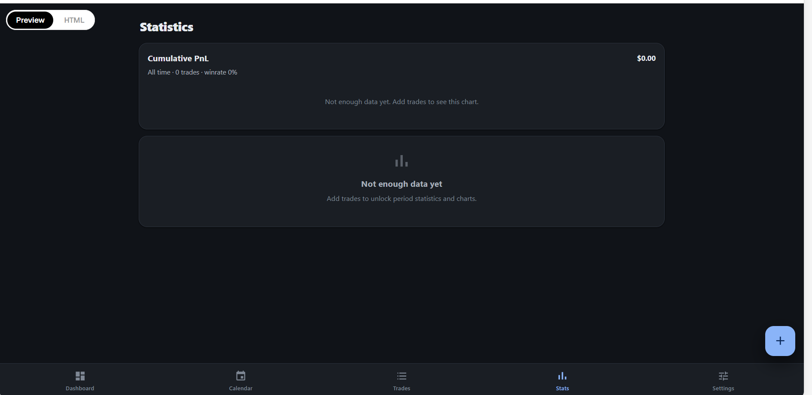
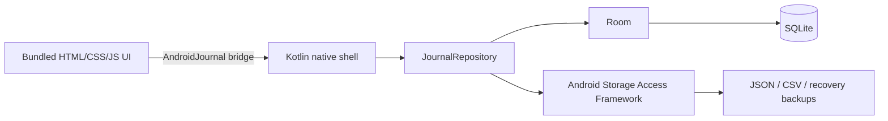

<p align="center">
  
</p>

<p align="center">
  <a href="https://github.com/rahmatmaul/trading-pnl-journal-android/actions/workflows/android.yml"></a>
  
  
  
  
</p>

<p align="center">
  Jurnal trading Android yang sederhana, cepat, dan benar-benar offline.<br>
  Tidak ada akun, server, iklan, tracker, atau database cloud.
</p>

<p align="center">
  <a href="https://github.com/rahmatmaul/trading-pnl-journal-android/releases/latest"><strong>Download APK terbaru</strong></a>
  ·
  <a href="#cara-install"><strong>Cara install</strong></a>
  ·
  <a href="#build-dari-source"><strong>Build source</strong></a>
</p>

## Kenapa aplikasi ini ada?

Banyak jurnal trading berbasis web menyimpan data penting di `localStorage`.
Jika browser membersihkan storage, berjalan dalam mode terbatas, atau halaman
tidak lagi tersedia, catatan trade berisiko hilang.

Trading PnL Journal memindahkan sumber data utama ke **Room + SQLite**. Tombol
**Save Trade** baru dinyatakan berhasil setelah data benar-benar ditulis ke
database lokal Android.

## Tampilan

| Dashboard | Calendar |
| --- | --- |
|  |  |

| Add trade | Statistics |
| --- | --- |
|  |  |

## Fitur

- Dashboard PnL, win rate, average, best/worst trade, dan recent trades.
- Kalender bulanan dan ringkasan performa per hari.
- Tambah, ubah, hapus, dan duplikasi trade.
- Filter berdasarkan periode, hasil, PnL, simbol, dan urutan waktu.
- Grafik cumulative PnL serta statistik harian, mingguan, dan bulanan.
- Theme light, dark, atau mengikuti sistem.
- Pengaturan balance, profit target, max drawdown, dan daily loss limit.
- Full backup JSON, export CSV, serta import Merge atau Replace.
- Recovery backup otomatis ke folder yang dipilih pengguna.
- Berjalan dalam airplane mode dan tidak memiliki permission `INTERNET`.

## Arsitektur



UI lama tetap dipertahankan sebagai asset lokal di dalam APK. WebView hanya
diizinkan membuka origin asset internal; network load diblokir, DOM storage
dimatikan, dan `localStorage` tidak digunakan untuk data jurnal.

## Keamanan data

Data internal bertahan saat aplikasi ditutup, dihapus dari Recents, di-force
stop, perangkat restart, dan APK baru dipasang di atas versi lama dengan
application ID serta signing key yang sama.

Android menghapus data privat aplikasi ketika aplikasi di-uninstall. Karena
itu, setelah instalasi buka:

**Settings → Recovery backup folder → Choose folder**

Pilih folder seperti `Documents/TradingJournal`. Sesudah perubahan database
berhasil, aplikasi membuat backup recovery terbaru dan menyimpan hingga lima
snapshot bertanggal.

## Cara install

1. Download `TradingPnLJournal-v1.0.0.apk` dari halaman
   [Releases](https://github.com/rahmatmaul/trading-pnl-journal-android/releases).
2. Buka file APK dari File Manager Android.
3. Jika diminta, izinkan **Install unknown apps** untuk File Manager tersebut.
4. Tekan **Install**, lalu buka aplikasinya.
5. Pilih recovery backup folder sebelum mulai mencatat trade penting.

Untuk update, install APK baru di atas versi lama. Jangan uninstall aplikasi
sebelum membuat full backup JSON.

## Build dari source

### Prasyarat

- JDK 17 atau 21
- Android SDK Platform 35
- Android Build Tools 35+

### Windows

```powershell
.\gradlew.bat testDebugUnitTest lintDebug assembleDebug --no-daemon
```

### Linux/macOS

```bash
./gradlew testDebugUnitTest lintDebug assembleDebug --no-daemon
```

APK debug akan tersedia di:

```text
app/build/outputs/apk/debug/app-debug.apk
```

## Pengujian

Suite JVM/Robolectric mencakup:

- add, update, delete, dan duplicate trade;
- persistensi setelah database ditutup dan dibuka kembali;
- persistensi settings;
- JSON export/import dan CSV escaping;
- Merge, Replace, dan duplicate ID behavior;
- penolakan backup malformed;
- kompatibilitas timestamp lama;
- normalisasi PnL positif untuk Win dan negatif untuk Loss.

Build rilis v1.0.0 diverifikasi dengan **10/10 test lulus**, Android lint tanpa
error, JavaScript syntax valid, serta pemeriksaan APK tanpa permission internet.

## Format backup

Importer menerima format journal version 1:

```json
{
  "app": "trading-pnl-journal",
  "version": 1,
  "exportedAt": "2026-09-11T00:00:00Z",
  "settings": {},
  "trades": []
}
```

Semua record divalidasi sebelum import. **Merge** mempertahankan data saat ini
dan melewati ID duplikat. **Replace** memvalidasi seluruh file terlebih dahulu,
kemudian mengganti data dalam satu transaksi database.

## Privasi

- Tidak ada analytics, telemetry, iklan, login, atau crash reporting remote.
- Tidak ada permission penyimpanan luas.
- Akses backup memakai folder/file picker resmi Android.
- Database dan UI dapat digunakan sepenuhnya tanpa koneksi internet.

## Kontribusi

Bug report dan ide fitur dipersilakan. Baca [CONTRIBUTING.md](CONTRIBUTING.md)
sebelum membuka pull request. Untuk masalah keamanan, ikuti
[SECURITY.md](SECURITY.md) dan jangan unggah backup jurnal asli.

## Lisensi

Belum ada lisensi penggunaan ulang yang diberikan. Source tersedia untuk
ditinjau, tetapi hak penggunaan, modifikasi, dan distribusi belum diberikan
sampai maintainer memilih lisensi proyek.
