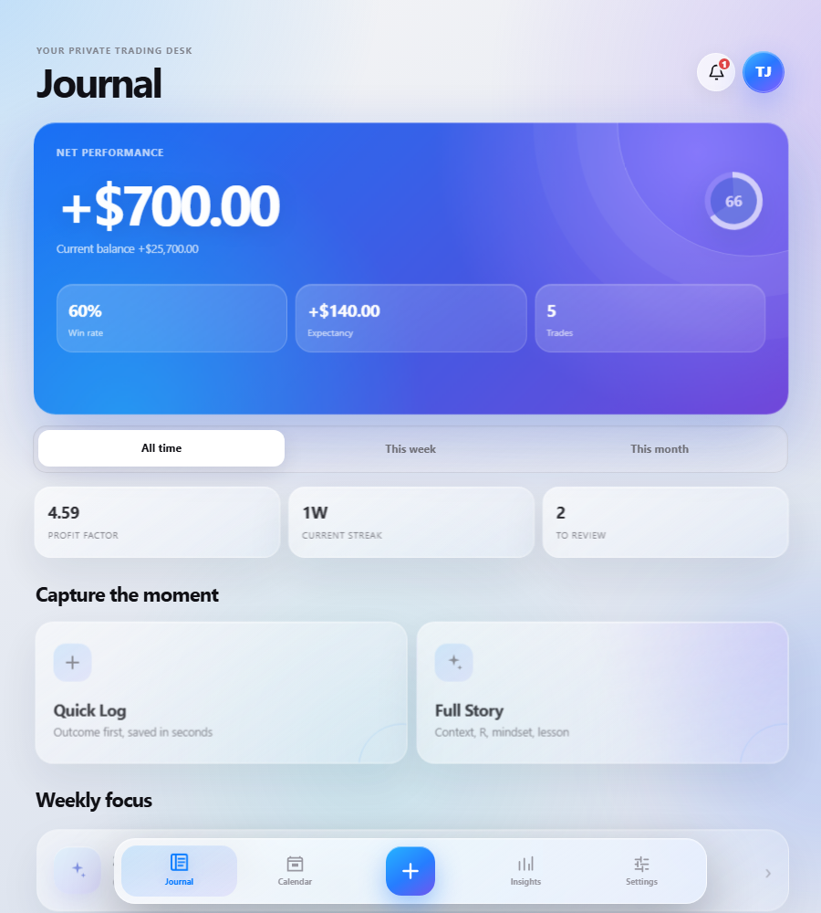
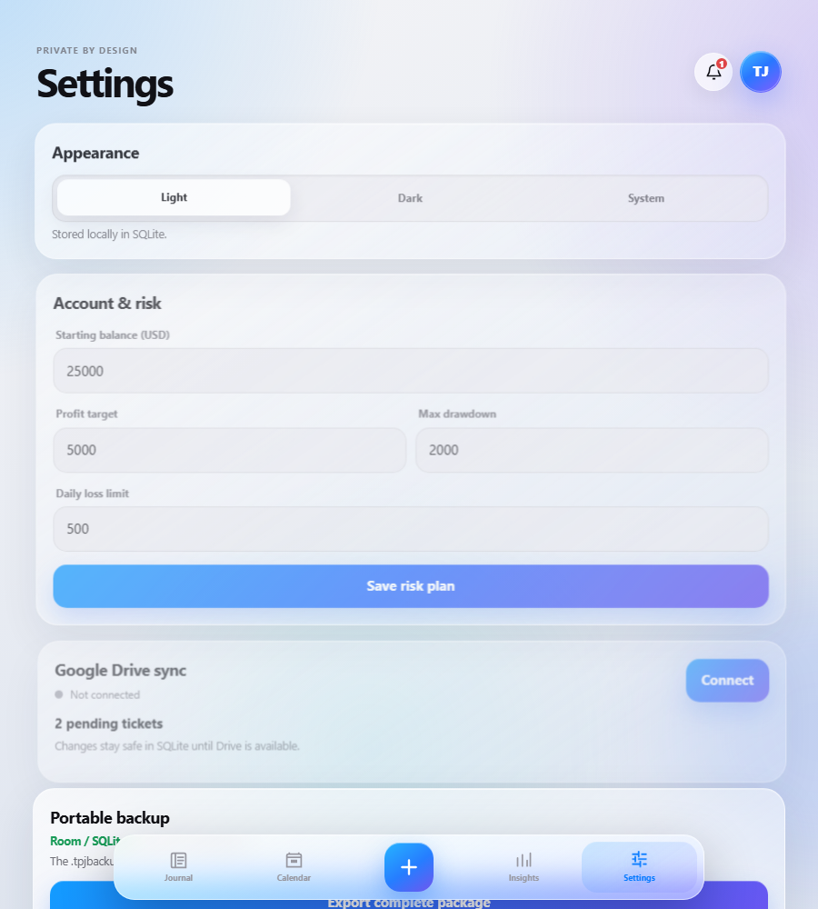
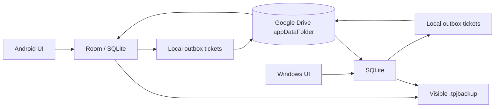

<p align="center">
  
</p>

<p align="center">
  <a href="https://github.com/rahmatmaul/trading-pnl-journal-android/actions/workflows/android.yml"></a>
  
  
  
  
</p>

<p align="center">
  Jurnal trading offline-first untuk Android dan Windows.<br>
  Data langsung aman di SQLite, lalu sinkron otomatis lewat Google Drive saat internet tersedia.
</p>

<p align="center">
  <a href="https://github.com/rahmatmaul/trading-pnl-journal-android/raw/main/release/TradingJournal-v4.0.0.apk"><strong>Download Android V4</strong></a>
  ·
  <a href="https://github.com/rahmatmaul/trading-pnl-journal-android/raw/main/release/TradingJournal-Windows-v4.0.0.zip"><strong>Download Windows V4</strong></a>
  ·
  <a href="#cara-install"><strong>Cara install</strong></a>
  ·
  <a href="#build-dari-source"><strong>Build source</strong></a>
  ·
  <a href="CHANGELOG.md"><strong>Changelog</strong></a>
</p>

## Trading Journal V4

V4 menjadikan satu jurnal bisa dipakai bergantian di Android dan Windows. Setiap
perubahan ditulis dulu ke SQLite lokal dan mendapat immutable sync ticket. Saat
online, hanya ticket yang belum diterima perangkat lain yang diproses; jurnal
tetap dapat dibuka dan diedit penuh ketika offline.

<p align="center">
  
  
</p>

### Yang baru di V4

- Android dan Windows memakai protocol ticket yang sama untuk trade, settings,
  tombstone delete, dan screenshot chart.
- Windows memeriksa tiket baru setiap 60 detik saat aplikasi terbuka; Android
  memakai worker berjadwal hemat baterai dan keduanya langsung antre sync setelah perubahan lokal.
- Google Drive `appDataFolder` menjadi jembatan sinkron tersembunyi; bukan sumber
  kebenaran tunggal dan tidak perlu tombol sync untuk pemakaian normal.
- Conflict resolution deterministik berbasis `updatedAt` dan event ID.
- Profile sheet, notification center, pending-ticket counter, last-sync status,
  pesan recovery, dan peringatan merah bila storage Drive bermasalah.
- Tombol backup manual membuat paket lengkap `.tpjbackup` di folder terlihat
  **Trading Journal Backups** pada Google Drive.
- Migrasi Room V2→V3 eksplisit; data versi lama tetap dipertahankan.

## Fondasi UI V3.1

<p align="center"></p>

V3.1 memoles jurnal menjadi **Trading Performance OS** yang terasa lebih hidup tetapi tetap ringan.
Quick Log mempertahankan pencatatan dalam hitungan detik, sementara Full Story,
Trade Replay, Adaptive Playbook, Weekly Review, dan analitik lanjutan membantu
menjelaskan mengapa performa terjadi—bukan hanya menampilkan angka akhirnya.

Motion Engine V3.1 memakai transisi keluar–masuk yang mengikuti arah navigasi,
spring settle yang singkat, serta stagger hanya pada elemen penting. Seluruh gerak
utama memakai `transform` dan `opacity`, sedangkan blur kaca dibatasi ke layer
pilihan agar tetap mulus di Android WebView.

Patch V3.1.1 memakai jalur render khusus Android: tampilannya tetap seperti kaca,
tetapi live backdrop blur, multi-card stagger, dan animasi shadow yang berat tidak
dijalankan di WebView.

V3.1.2 meningkatkan opacity permukaan Android untuk keterbacaan dan mengganti
gerakan sheet satu layar penuh dengan short lift 26 px yang lebih ringan.

V3.1.3 memisahkan layer gerak dari area scroll form. Tombol tambah mendapat satu
frame respons sebelum form dipasang, lalu sheet bergerak sebagai satu texture GPU
tanpa animasi scale, opacity, blur, atau shadow yang mahal.

<p align="center">
  
  
  
  
  
</p>

<p align="center"><sub>Screenshot aktual: V3.1 Journal, Full Story, Insights, Adaptive Playbook, dan Trade Replay.</sub></p>

### Yang baru di V3.1

- **Directional motion**: layar lama keluar lebih dahulu, lalu layar baru masuk
  dari arah navigasi dengan spring settle yang halus.
- **Purposeful movement**: hero, signal, card utama, modal, toast, dan bottom nav
  punya respons gerak singkat tanpa animasi dekoratif yang terus berjalan.
- **Clearer glass**: permukaan lebih transparan, edge highlight lebih tegas, dan
  ambient blue/violet membuat efek blur terbaca tanpa tampak abu-abu.
- **Android-first performance**: blur berat pada backdrop dihapus dan animasi
  dibatasi ke properti yang dapat dikomposisi GPU.
- **Reduced motion**: preferensi aksesibilitas Android tetap dihormati.

### Fondasi fitur V3.0

- **Quick Log / Full Story switch**: pilih pencatatan super cepat atau review
  lengkap tanpa berpindah alur.
- **Adaptive Playbook**: setup terbentuk otomatis dari data trade, lengkap dengan
  grade, sample confidence, win rate, dan average PnL.
- **Trade Replay**: baca ulang thesis, execution, result, lesson, serta chart
  before/after dalam satu alur visual.
- **Discipline Score**: mengukur kualitas kebiasaan dari konteks, review,
  execution score, dan bukti chart—tidak dipengaruhi besar profit.
- **Weekly Review**: ringkasan mingguan dan satu rekomendasi tindakan berikutnya.
- **Advanced Insights**: profit factor, expectancy, maximum drawdown, average R,
  review completion, setup/session edge, dan biaya setiap mistake tag.
- Command-center dashboard dan visual hierarchy baru dengan motion yang tetap
  ringan untuk Android WebView.

## Fitur final

| Area | Kemampuan |
| --- | --- |
| Quick / Full Log | Pencatatan hasil dalam detik atau review lengkap dalam alur yang sama |
| Trade Story | Setup, session, emotion, planned/realized R, execution score, mistake tags, lesson, dan review status |
| Trade Replay | Alur thesis, execution, result, lesson, serta before/after evidence |
| Adaptive Playbook | Setup grade, sample confidence, coverage, win rate, dan average PnL |
| Chart evidence | Hingga 6 screenshot per trade sebagai Before/thesis atau After/result |
| Journal | Net performance, discipline score, expectancy, profit factor, streak, recent trades, dan review queue |
| Calendar | Ringkasan harian, jumlah trade, win rate, dan net PnL bulanan |
| Insights | Profit factor, expectancy, max drawdown, Average R, mistake cost, consistency, setup edge, dan session edge |
| Weekly Review | Debrief fokus dan next best action berdasarkan data minggu berjalan |
| Trade management | Add, edit, delete, duplicate, detail, filter periode/result/symbol, dan sorting |
| Risk settings | Starting balance, profit target, max drawdown, dan daily loss warning |
| Personalization | Light, dark, atau mengikuti tema Android |
| Cross-device sync | Ticket-based automatic sync Android ↔ Windows melalui Google Drive |
| Sync safety | Offline queue, idempotent receipts, deterministic merge, tombstone delete, dan retry |
| Notifications | Status sync, recovery, dan peringatan Drive penuh tersimpan di aplikasi |
| Data portability | Full package, JSON, CSV, Merge import, Replace import, dan automatic recovery |
| Offline-first | Semua baca/tulis memakai SQLite lokal; internet hanya dipakai saat Drive sync/backup diaktifkan |

## Data yang tidak hilang saat aplikasi ditutup

Sumber kebenaran jurnal adalah **Room + SQLite**, bukan `localStorage`. Tombol
**Save trade** baru menampilkan sukses setelah transaksi database selesai.

Data internal bertahan saat berpindah halaman, aplikasi ditutup, dihapus dari
Recents, di-force-stop, perangkat reboot, dan APK dengan signature yang sama
dipasang sebagai update. Android tetap menghapus private app data saat uninstall,
jadi portable backup tetap penting.

## Arsitektur



UI hanya memuat asset lokal. Android WebView tetap memblokir navigasi eksternal;
akses jaringan dilakukan oleh native sync worker, bukan halaman web. Gambar chart
disimpan privat pada tiap perangkat dan dipindahkan sebagai blob SHA-256 tanpa
mengunggah duplikat yang sama.

## Backup dan restore

### Full package — direkomendasikan

File `.tpjbackup` adalah ZIP tervalidasi yang membawa:

- `journal.json` berisi trade, settings, dan metadata attachment;
- chart JPEG, PNG, atau WebP;
- ukuran file serta SHA-256 checksum untuk mendeteksi kerusakan.

**Merge** menambahkan ID trade yang belum ada. **Replace** memvalidasi seluruh
paket sebelum mengganti jurnal dalam satu transaksi. Jalur ZIP diperiksa untuk
mencegah path traversal, ukuran file dibatasi, dan file sementara dibersihkan
jika import gagal.

JSON tetap tersedia untuk backup lama V1/V2 dan pertukaran tanpa gambar. CSV
ditujukan untuk spreadsheet dan memuat metadata review. Untuk automatic recovery,
buka **Settings → Automatic recovery → Choose backup folder** lalu pilih folder
melalui Android Storage Access Framework. Aplikasi menyimpan hingga lima snapshot.

## Cara install

1. Download [`TradingJournal-v4.0.0.apk`](https://github.com/rahmatmaul/trading-pnl-journal-android/raw/main/release/TradingJournal-v4.0.0.apk).
2. Buka file melalui File Manager di Android.
3. Jika diminta, aktifkan **Install unknown apps** hanya untuk File Manager yang
   digunakan.
4. Tekan **Install**, buka aplikasi, lalu hubungkan akun Google pada Profile atau Settings bila ingin sync.

Windows: download `TradingJournal-Windows-v4.0.0.zip`, extract seluruh folder,
lalu jalankan `TradingJournal.exe`. Gunakan akun Google test-user yang sama di
Android dan Windows. Credential OAuth Desktop dibaca dari `%APPDATA%\TradingJournal`
atau file `client_secret_*.json` terbaru di Downloads dan tidak disertakan di repo.

Untuk update dari versi lama, pasang APK baru langsung di atas aplikasi lama dan
**jangan uninstall versi lama terlebih dahulu**. Migrasi Room eksplisit
mempertahankan trade yang sudah tersimpan. Buat backup sebelum update sebagai
langkah berjaga-jaga.

## Build dari source

Prasyarat: JDK 17/21, Android SDK Platform 35, dan Build Tools 35+.

Windows:

```powershell
.\gradlew.bat :app:testDebugUnitTest :app:lintDebug :app:assembleDebug --no-daemon
$env:JAVA_HOME = "C:\path\to\jdk-21"
.\desktop\package-windows.ps1 -Version 4.0.0
```

Linux/macOS:

```bash
./gradlew testDebugUnitTest lintDebug assembleDebug --no-daemon
```

APK debug tersedia di `app/build/outputs/apk/debug/app-debug.apk`; paket Windows
mandiri tersedia di `release/TradingJournal-Windows-v4.0.0.zip`. Asset font
mentah tidak disertakan dalam repository; source tetap dapat dibangun dan akan
menggunakan system sans-serif sebagai fallback bila asset lokal tidak tersedia.

## Riwayat versi

| Versi | Fokus update |
| --- | --- |
| **V4.0** | Android + Windows, auto-sync Drive, screenshot sync, profile, notifications, dan backup Drive |
| **V3.1.3** | Sheet compositor terpisah, respons tombol lebih cepat, dan Quick Log lazy paint |
| **V3.1.2** | Kaca Android lebih solid, short-lift sheet, dan navigasi satu tahap 210 ms |
| **V3.1.1** | Android performance path: faux glass, single-layer motion, dan durasi transisi lebih singkat |
| **V3.1** | Motion Engine baru, directional spring transitions, micro-interactions, dan selective glass blur |
| **V3.0** | Trading Performance OS, Full Story, Trade Replay, Adaptive Playbook, discipline score, dan advanced Insights |
| **V2.5** | Visual polish, typography, adaptive icon, dan motion yang lebih mulus |
| **V2.0** | Quick Log, Trade Story, chart evidence, Insights, dan `.tpjbackup` |
| **V1.0** | Fondasi offline, Room/SQLite, CRUD, JSON/CSV, calendar, dan stats |

Rincian setiap rilis tersedia di [CHANGELOG.md](CHANGELOG.md).

## Pengujian

Suite JVM/Robolectric mencakup 21 test untuk CRUD, duplicate, reopen persistence,
settings, Win/Loss sign normalization, JSON legacy/V2, CSV escaping, malformed
backup, duplicate merge, atomic replace, attachment cascade, package checksum
round-trip, dan migrasi database V1→V2 tanpa kehilangan trade.

```powershell
.\gradlew.bat testDebugUnitTest --no-daemon
```

## Privasi dan keamanan

- Tidak ada analytics, telemetry, iklan, atau remote crash reporting.
- Tidak ada broad storage permission. Internet hanya dipakai saat fitur Google Drive diaktifkan.
- Data jurnal utama berada di perangkat; Drive menjadi jembatan sync dan lokasi backup pilihan pengguna.
- Import selalu divalidasi sebelum data aktif diubah.

## Kontribusi

Bug report dan ide fitur dipersilakan. Baca [CONTRIBUTING.md](CONTRIBUTING.md)
sebelum membuka pull request. Untuk masalah keamanan, ikuti
[SECURITY.md](SECURITY.md) dan jangan pernah unggah backup jurnal asli.

## Lisensi

Belum ada lisensi penggunaan ulang yang diberikan. Source tersedia untuk
ditinjau, tetapi hak penggunaan, modifikasi, dan distribusi belum diberikan
sampai maintainer memilih lisensi proyek.
