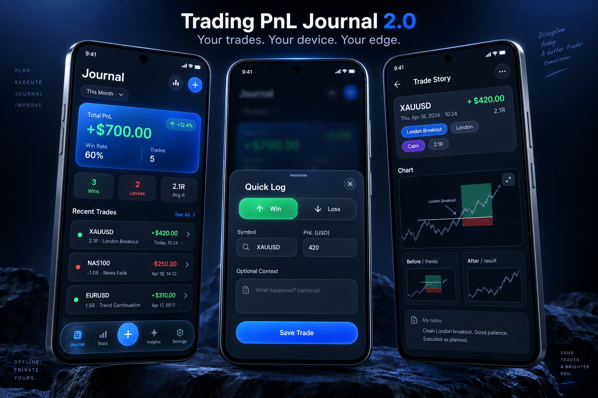
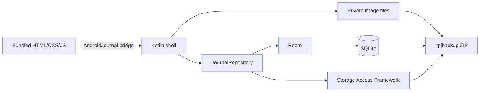

<p align="center">
  
</p>

<p align="center">
  <a href="https://github.com/rahmatmaul/trading-pnl-journal-android/actions/workflows/android.yml"></a>
  
  
  
  
</p>

<p align="center">
  Jurnal trading Android yang cepat, visual, dan benar-benar offline.<br>
  Tidak ada akun, server, iklan, tracker, atau database cloud.
</p>

<p align="center">
  <a href="https://github.com/rahmatmaul/trading-pnl-journal-android/releases/latest"><strong>Download APK terbaru</strong></a>
  ·
  <a href="#cara-install"><strong>Cara install</strong></a>
  ·
  <a href="#build-dari-source"><strong>Build source</strong></a>
</p>

## Tampilan V2



<p align="center"><sub>Product mockup V2 — tampilan pada perangkat dapat sedikit berbeda mengikuti ukuran layar dan tema Android.</sub></p>

## Apa yang baru di V2.0?

V2 mengubah jurnal sederhana menjadi **trading review system** tanpa membuat
proses mencatat jadi berat.

- UI baru bergaya Apple: glass surface, tipografi besar, warna yang terkontrol,
  dan floating navigation.
- **Quick Log** tetap cukup dengan tanggal, simbol, Win/Loss, dan PnL.
- **Trade Story** dapat dilengkapi belakangan dengan setup, session, emotion,
  planned/realized R, execution score, mistake tags, serta lesson.
- Upload hingga 6 chart screenshot sekaligus sebagai **Before / thesis** atau
  **After / result**.
- Insight setup dan session, average R, consistency, serta progress review.
- Backup `.tpjbackup` membawa trade, settings, metadata, dan semua gambar.
- Migrasi Room `1 → 2` eksplisit; tidak ada destructive fallback.

> Screenshot di folder `docs/screenshots` adalah arsip tampilan V1. Screenshot
> V2 akan diperbarui dari perangkat Android agar dokumentasi tidak menampilkan
> hasil render palsu.

## Prinsip data

Sumber kebenaran jurnal adalah **Room + SQLite**, bukan `localStorage`. Tombol
**Save trade** baru menampilkan sukses setelah transaksi database selesai.

Data internal bertahan ketika aplikasi ditutup, dihapus dari Recents,
di-force-stop, perangkat reboot, serta ketika APK yang ditandatangani dengan key
yang sama dipasang sebagai update. Android tetap menghapus private app data saat
uninstall, sehingga portable backup sangat dianjurkan.

## Fitur

- Journal dashboard, equity curve, calendar, daily summary, dan trade history.
- CRUD trade lengkap serta duplicate trade beserta gambarnya.
- Filter periode, result, dan symbol.
- Trade Story dengan dua galeri chart dan progressive review form.
- Insight performa berdasarkan setup/session dan periode.
- Theme light, dark, atau mengikuti Android.
- Starting balance, profit target, max drawdown, dan daily loss warning.
- Full package export/import dengan mode Merge atau Replace.
- JSON V1/V2 kompatibel dan CSV untuk spreadsheet.
- Automatic recovery package ke folder pilihan pengguna.
- Airplane-mode ready tanpa permission `INTERNET`.

## Arsitektur



WebView hanya memuat asset lokal dari `appassets.androidplatform.net`. Request
di luar origin lokal diblokir, DOM storage dimatikan, dan manifest tidak meminta
akses internet. Chart image disimpan di private app storage; metadata dan SHA-256
checksum-nya disimpan di Room.

## Backup dan restore

### Complete package — direkomendasikan

File `.tpjbackup` adalah ZIP tervalidasi yang berisi:

- `journal.json` untuk trade, settings, dan metadata attachment;
- file chart JPEG, PNG, atau WebP;
- ukuran serta SHA-256 checksum untuk mendeteksi file rusak.

**Merge** hanya memasukkan ID trade yang belum ada beserta gambarnya. **Replace**
memvalidasi paket terlebih dahulu lalu mengganti jurnal dalam satu transaksi.
Jalur ZIP diperiksa untuk mencegah path traversal, ukuran file dibatasi, dan file
sementara dibersihkan bila import gagal.

### JSON dan CSV

JSON tetap tersedia untuk kompatibilitas backup jurnal V1 dan pertukaran data
tanpa gambar. CSV ditujukan untuk spreadsheet dan kini memuat metadata review V2.

### Automatic recovery

Buka **Settings → Automatic recovery → Choose backup folder** lalu pilih folder
melalui Android Storage Access Framework. Tidak ada broad storage permission.
Setelah persistent change berhasil, aplikasi memperbarui recovery package dan
menyimpan hingga lima snapshot bertanggal.

## Cara install

1. Download `TradingPnLJournal-v2.0.0.apk` dari
   [GitHub Releases](https://github.com/rahmatmaul/trading-pnl-journal-android/releases).
2. Buka APK dari File Manager Android.
3. Jika Android meminta izin, aktifkan **Install unknown apps** hanya untuk File
   Manager yang digunakan.
4. Tekan **Install**, buka aplikasi, lalu pilih automatic recovery folder.

Untuk update V1 ke V2, pasang APK V2 langsung di atas V1. **Jangan uninstall V1**.
Migrasi Room mempertahankan trade lama dan memberi nilai default pada field V2.
Tetap buat JSON backup sebelum update sebagai langkah berjaga-jaga.

## Build dari source

Prasyarat: JDK 17/21, Android SDK Platform 35, dan Build Tools 35+.

Windows:

```powershell
.\gradlew.bat testDebugUnitTest lintDebug assembleDebug --no-daemon
```

Linux/macOS:

```bash
./gradlew testDebugUnitTest lintDebug assembleDebug --no-daemon
```

APK debug tersedia di `app/build/outputs/apk/debug/app-debug.apk`.

## Pengujian

Suite JVM/Robolectric mencakup 14 test untuk CRUD, duplicate, reopen persistence,
settings, sign normalization, JSON legacy/V2, CSV escaping, malformed backup,
duplicate merge, atomic replace, attachment cascade, package checksum round-trip,
dan migrasi database V1→V2 tanpa kehilangan trade.

Jalankan hanya test:

```powershell
.\gradlew.bat testDebugUnitTest --no-daemon
```

## Privasi dan keamanan

- Tidak ada analytics, telemetry, iklan, login, atau crash reporting remote.
- Tidak ada permission penyimpanan luas maupun permission internet.
- Semua data sensitif tetap berada di perangkat dan folder backup yang dipilih.
- Import divalidasi sebelum data aktif diubah.

## Kontribusi

Bug report dan ide fitur dipersilakan. Baca [CONTRIBUTING.md](CONTRIBUTING.md)
sebelum membuka pull request. Untuk masalah keamanan, ikuti
[SECURITY.md](SECURITY.md) dan jangan pernah unggah backup jurnal asli.

## Lisensi

Belum ada lisensi penggunaan ulang yang diberikan. Source tersedia untuk
ditinjau, tetapi hak penggunaan, modifikasi, dan distribusi belum diberikan
sampai maintainer memilih lisensi proyek.
